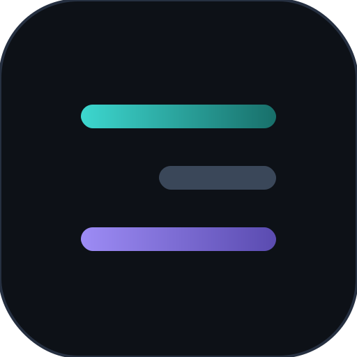
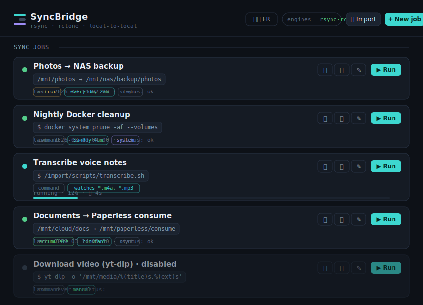
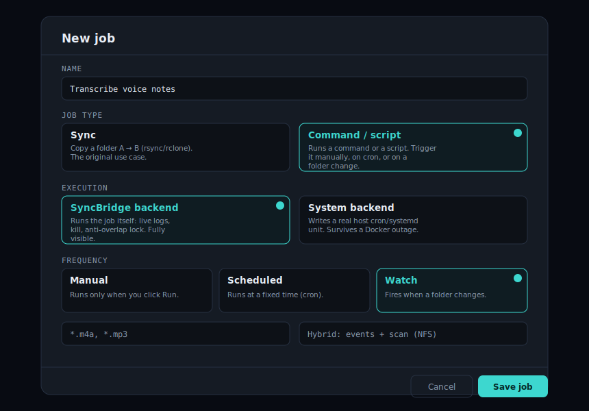

<p align="center">
  
</p>

<h1 align="center">SyncBridge — HomeLab Orchestrator</h1>

<p align="center">
  <b>One web UI to centralize your Linux scripts:</b> cron jobs ⏰, folder watchers 👀 (inotify), and rsync/rclone syncs 🔁 — with live logs, safety guards, and nothing hidden from you.
</p>

<p align="center">
  
  
  
  
  
</p>

<p align="center">🇫🇷 <a href="docs/README.fr.md">Version française du README</a></p>

---

A lightweight, self-hosted alternative to scattered crontabs, background `inotifywait` loops, and one-off rsync scripts. Think *cronmaster + an rsync web UI + an inotify manager*, in a single **8 MB Go binary**. No database, no build step: pull the image and go. 🐳

## 🖼️ Screenshots

<p align="center"></p>
<p align="center"><i>The dashboard — every job, its trigger, live status. Sync jobs and command/script jobs side by side.</i></p>

<p align="center"></p>
<p align="center"><i>Composing a job visually — pick a type, a backend, a trigger. No script to write.</i></p>

## 🤔 Why

If your homelab looks like mine — a `CRON/` folder here, an `inotify/` watcher there, a dozen rsync one-liners you half-remember — SyncBridge pulls all of it into one place. You pick a **trigger** (on a schedule, when a folder changes, or on demand) and an **action** (an rsync/rclone sync, or any shell command/script), from a UI. No more editing crontabs by hand and hoping. 🤞

The rule of the house: **total visibility**. Nothing runs that you can't see. Every execution captures `stdout`/`stderr` to a live dashboard, and dangerous operations are refused before they can hurt you.

## ✨ Features

- ⏰ **Job Scheduler** — standard 5-field cron to run any script or command (`docker system prune`, stack updates, DB exports, diagnostics…).
- 👀 **File Watcher** — watch a folder, filter by pattern (`*.mp4`), fire an action. **NFS-safe**: hybrid inotify + polling, because inotify alone never sees remote NFS writes.
- ▶️ **On-Demand Runner** — trigger utility scripts manually, async, with streamed logs and a kill button.
- 🔁 **rsync / rclone sync** — mirror / accumulate / move, checksum or time compare, bandwidth limit, exclusions, rotating trash, faithful system backup (ACL/xattr).
- 🔎 **System Monitor** *(read-only)* — scans host crontabs, systemd units (`.service`/`.timer`/`.path`) and stray `inotifywait` processes, so nothing on your box escapes you.

## 🛡️ Safety first

SyncBridge refuses to shoot you in the foot:

- 💥 **Empty/unmounted source guard** — the classic rsync disaster: a mirror whose NFS source got unmounted looks *empty*, and `--delete` wipes the destination. SyncBridge **aborts** the run instead.
- 🔒 **Anti-overlap lock** — a job never stacks on top of itself (fast watchers, cron overrunning its own interval).
- ⏱️ **Timeout** — a hung job is killed after N seconds (whole process group), because a job that hangs forever is worse than one that fails.
- 🚧 **Delete guardrails** — mirror refuses `source == dest` and dest-inside-source; optional max-deletions abort.
- ✅ **Write-completion check** — a watcher waits for the folder to go quiet (stable size) before firing, so half-copied files aren't synced.

## 🚀 Install (pre-built image — no build)

```bash
mkdir syncbridge && cd syncbridge
curl -O https://raw.githubusercontent.com/GodsQuantum/SyncBridge/main/compose.example.yaml
curl -O https://raw.githubusercontent.com/GodsQuantum/SyncBridge/main/.env.example
cp .env.example .env
# adjust the volumes in compose.example.yaml to your paths, then:
docker compose -f compose.example.yaml up -d
```

Open `http://<server-ip>:8788` 🌐. Your jobs live in `./data/jobs.json` — back up that folder and you've backed up everything. The image is multi-arch (amd64 + arm64) on `ghcr.io/godsquantum/syncbridge:latest`.

### 📋 Step by step

1. **Create the config folder** and grab the two files above (`compose.example.yaml`, `.env.example`).
2. **Write your `.env`** — sensible defaults ship in `.env.example`; the only thing most people change is `TZ`.
3. **Pick your volumes** (bind mounts). The only required one is `./data:/config`. Map the host folders you sync between, the scripts you want to trigger (`:ro` is enough), and — if you want the read-only System Monitor — the `/host/...` mounts. Every line is documented inline in `compose.example.yaml`, including the optional Docker socket (for `docker` jobs) and the `rshared` `/mnt` mount (for nested NFS).
4. **`docker compose up -d`**, open the UI, create your first job. Use **dry-run** on syncs before trusting them. 🧪

## 🎛️ Trigger types

| Trigger | Fires when | Example |
|---|---|---|
| 🖐️ Manual | you click Run | `YT.sh <url>` |
| ⏰ Cron | a schedule | `0 4 * * *` → `docker system prune -f` |
| 👀 Watch | a folder changes | a `.mp4` lands → run an rsync, or an ffmpeg script |

## ⚙️ Execution backends (per job)

Every job picks where it runs:

- 🟢 **SyncBridge backend** *(default)* — SyncBridge runs the job itself: live logs, kill button, clean shutdown, anti-overlap lock. Simple and fully visible. Stops if the container stops.
- 🟣 **System backend** — SyncBridge writes a **real host cron entry** (`/etc/cron.d`, with `flock` + `PATH`) or a **systemd `.path`/`.service` unit**, so the job **keeps running even if Docker/SyncBridge is down**. Invariant: the artifact is removed before any rewrite and cleaned up on delete or backend switch — never a hidden duplicate. Writing host cron needs a read-write mount; the systemd variant needs a privileged container (see `compose.example.yaml`).

## 🔌 API

```
GET/POST   /api/jobs             list / create
PUT/DELETE /api/jobs/{id}        edit / delete
POST       /api/jobs/{id}/run    run (?dry=1 to simulate a sync)
GET        /api/jobs/{id}/stream live logs (SSE)
POST       /api/jobs/{id}/kill   stop the running job
GET        /api/system/scan      host triggers detected (read-only)
GET        /api/import/scan      rsync/rclone commands found in your scripts/crontab
```

## 🛠️ Development

```bash
go build -o syncbridge .   # static binary
go test ./...              # unit tests
docker build -t syncbridge .
```

One Go package, a handful of files (`main.go`, `sysmon.go`, `system_backend.go`, `web/`). Easy to fork. 🍴

## 🗺️ Roadmap

Drive a second server over SSH · USB auto-ingest triggers · richer per-job history.

## 🔍 Keywords

self-hosted cron manager · cronmaster alternative · rsync web UI · rclone GUI · inotify watcher manager · folder-watch automation · homelab orchestrator · docker cron scheduler · centralize Linux scripts · systemd timer dashboard · self-hosted task scheduler.

## 📄 License

MIT — see [LICENSE](LICENSE). Contributions welcome. ❤️
